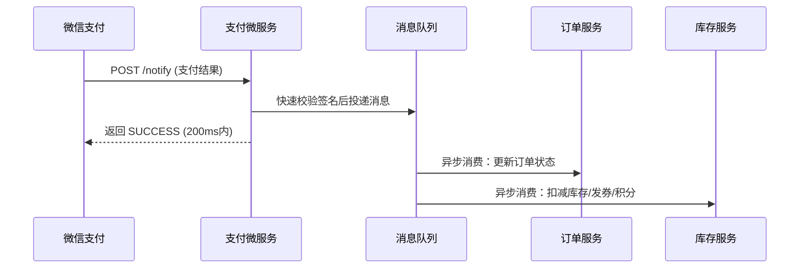

### 微服务架构适配
- 将支付服务独立为 **支付微服务**
- 使用 **Feign Client** 调用支付服务
- 通过 **消息队列** 处理异步通知

### 多支付方式支持
```java
// 支付策略模式
public interface PaymentStrategy {
    PaymentResult pay(PaymentRequest request);
}

@Component
public class WeChatPayStrategy implements PaymentStrategy {
    // 微信支付实现
}

@Component
public class AlipayStrategy implements PaymentStrategy {
    // 支付宝实现
}
```

> 📚 **官方文档参考**：[微信支付开发文档](https://pay.weixin.qq.com/wiki/doc/apiv3/open/pay/chapter2_1_0.shtml)

在高并发、大量订单的场景下，**仅靠“支付微服务 + 消息队列处理异步通知”是不够的**。虽然消息队列（如 Kafka、RocketMQ、RabbitMQ）确实是解决支付回调高并发问题的关键组件，但要构建一个**稳定、可靠、可扩展**的支付系统，还需要考虑更多维度的设计。

---

## ✅ 为什么需要消息队列？

微信/支付宝等支付平台在用户支付成功后，会**主动向你的服务器发送异步通知（Notify）**。如果直接在 HTTP 接口中同步处理：

- 数据库写入慢 → 响应超时 → 支付平台重试（最多10次）
- 高并发时线程阻塞 → 服务雪崩
- 业务逻辑复杂（如发券、积分、库存）→ 失败率高

**引入消息队列后：**


✅ **优势**：
- 支付回调接口响应极快（<200ms），避免重试
- 业务解耦，失败可重试
- 流量削峰，保护下游服务

---

## ⚠️ 但仅靠 MQ 远远不够！必须补充以下能力：

### 1. **幂等性设计（最关键！）**
支付平台可能因网络问题**重复推送通知**（即使你已返回 SUCCESS）。

**解决方案**：
- 用 `out_trade_no`（商户订单号）作为唯一键
- 在数据库建唯一索引，或使用 Redis 分布式锁
- 消费前先查是否已处理

```java
// 示例：幂等处理
public void handlePayNotify(String outTradeNo) {
    if (redis.setNx("pay_processed:" + outTradeNo, "1", 3600)) {
        // 执行业务逻辑：更新订单、扣库存等
        processOrder(outTradeNo);
    }
}
```

### 2. **消息可靠性保障**
- **生产端**：开启事务/确认机制，确保消息不丢失
- **消费端**：手动 ACK，处理成功后再提交 offset
- **死信队列**：处理多次失败的消息，人工介入

### 3. **对账机制（兜底）**
即使有 MQ，也可能因极端情况（如服务宕机）导致漏单。

**必须每天跑对账任务**：
- 调用微信支付【查询订单 API】
- 对比本地订单状态 vs 微信实际状态
- 自动修复不一致订单（如补发通知）

### 4. **限流与降级**
- 支付回调接口加限流（如 Sentinel），防刷
- 下游服务（如库存）不可用时，消息可暂存，后续重试

### 5. **监控与告警**
- 监控 MQ 积压量（lag）
- 支付成功率、回调失败率实时告警
- 日志全链路追踪（TraceID）

---

## 🛠️ 推荐架构（高并发支付系统）

```
[微信支付] 
    ↓ (HTTPS Notify)
[API Gateway] → 限流、鉴权
    ↓
[支付微服务] → 快速验签 + 投递MQ（<100ms）
    ↓
[RocketMQ] （高吞吐、持久化）
    ↓
[订单消费者] → 幂等更新订单
[库存消费者] → 扣减库存（带分布式锁）
[营销消费者] → 发券、积分
    ↓
[定时对账服务] → 每日凌晨跑对账，修复异常
```

---

## 💡 总结：可以，但要配套完整方案

| 能力 | 是否必需 | 说明 |
|------|--------|------|
| 消息队列异步处理 | ✅ 必需 | 解耦、削峰、快速响应 |
| 幂等性控制 | ✅ 必需 | 防止重复处理 |
| 对账机制 | ✅ 必需 | 最终一致性兜底 |
| 消息可靠性 | ✅ 必需 | 不丢消息、不重复消费 |
| 限流降级 | ⚠️ 推荐 | 保障系统稳定性 |
| 监控告警 | ⚠️ 推荐 | 快速发现问题 |

> 🔥 **结论**：  
> **“用消息队列处理异步通知”是正确方向，但必须配合幂等、对账、可靠性设计，才能支撑大量订单场景。**

如果你正在设计此类系统，建议参考：**微信支付官方《异步通知最佳实践》** + **阿里《RocketMQ 高可用实践》**。

