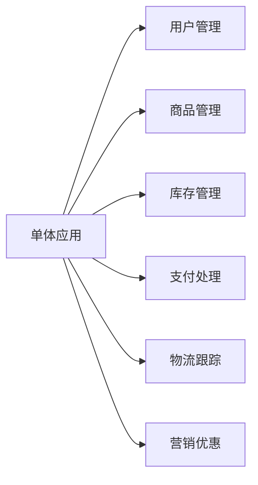
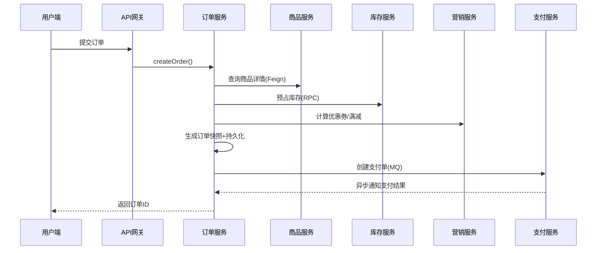

**是的，在微服务架构中，订单系统强烈建议独立为一个专门的微服务。** 这不仅是行业最佳实践，更是应对复杂业务、高并发和快速迭代的必然选择。

---

## ✅ 为什么订单系统必须独立成微服务？

### 1. **核心业务边界清晰**
订单是电商/交易类系统的**核心领域模型**，具有完整的生命周期：
- 创建 → 支付 → 发货 → 确认收货 → 售后 → 完成
- 涉及状态机、事务、定时任务（超时取消）等复杂逻辑

> 📌 **DDD（领域驱动设计）原则**：订单属于独立的“聚合根”，应封装在单独的服务中。

### 2. **高耦合风险隔离**
如果不拆分，订单逻辑会与以下模块深度耦合：

- 任一模块变更都可能影响订单稳定性
- 数据库表膨胀，查询性能下降

### 3. **独立扩展与弹性伸缩**
- 大促期间：**订单服务**需要横向扩容（如从4实例→50实例）
- 日常期间：其他服务（如用户服务）无需扩容
- **成本优化**：只为高负载模块付费

### 4. **技术栈灵活演进**
- 订单服务可用 **MySQL + 分库分表**（强一致性）
- 商品服务可用 **Elasticsearch**（高性能搜索）
- 用户服务可用 **MongoDB**（灵活文档结构）

> 🔥 如果不拆分，整个系统被锁定在单一技术栈！

### 5. **团队协作效率提升**
- **订单团队**专注订单状态机、超时逻辑、对账
- **支付团队**专注微信/支付宝对接、风控
- **商品团队**专注SKU管理、价格计算  
→ 符合 **康威定律**（系统架构 ≈ 组织架构）

---

## 🛠️ 订单微服务的核心职责

| 功能模块 | 说明 |
|----------|------|
| **订单创建** | 校验库存、计算价格、生成唯一订单号 |
| **状态管理** | 实现状态机（待支付→已支付→已发货→...） |
| **超时控制** | 延迟队列/RabbitMQ TTL 自动取消未支付订单 |
| **数据存储** | 订单主表 + 订单项表 + 快照（防价格篡改） |
| **对外接口** | 提供 Feign Client / OpenAPI 供其他服务调用 |
| **事件发布** | 订单创建成功 → 发布 `OrderCreatedEvent` |

---

## 🔗 订单服务如何与其他微服务协作？

### 典型交互流程（下单场景）

### 关键设计原则：
1. **最终一致性**：通过消息队列（而非分布式事务）保证数据一致
2. **防腐层（Anti-Corruption Layer）**：订单服务不直接依赖其他服务的数据库
3. **幂等接口**：`createOrder()` 支持重复调用（防网络重试）

---

## ⚠️ 不拆分订单服务的后果（真实案例）

| 问题 | 影响 |
|------|------|
| **大促雪崩** | 订单写库慢 → 整个应用线程池耗尽 → 所有功能不可用 |
| **发布风险** | 修改商品模块代码 → 意外破坏订单计算逻辑 → 资损 |
| **排查困难** | 日志混杂，无法快速定位订单问题 |
| **技术债务** | 无法引入新数据库（如TiDB分库分表） |

> 💡 某电商平台曾因未拆分订单服务，在双11导致 **全站宕机2小时**，损失超千万。

---

## 📊 什么规模需要拆分？

| 业务阶段 | 建议 |
|----------|------|
| **初创期**（日订单<1000） | 可暂不拆分，但需代码模块化隔离 |
| **成长期**（日订单1万+） | **必须拆分**！否则技术债爆发 |
| **成熟期**（日订单10万+） | 订单服务需进一步拆分：- 订单查询服务（读）- 订单写入服务（写）- 订单分析服务（BI） |

---

## 💎 总结：订单微服务是必选项

> **“如果你的系统涉及交易，订单服务就是你的心脏——它必须独立、强壮、可监控。”**

**行动建议**：
1. 用 **Spring Boot + Spring Cloud** 快速搭建订单微服务
2. 通过 **OpenFeign** 调用商品/库存服务
3. 用 **RocketMQ** 处理支付回调、物流更新等异步事件
4. **立即开始对账系统建设**（每日自动修复数据不一致）

> 📚 参考架构：阿里系电商（淘宝/天猫）将订单系统拆分为 **10+ 个子服务**，包括：  
> - 订单核心服务  
> - 订单查询服务  
> - 订单状态机服务  
> - 订单快照服务  
> - 订单对账服务